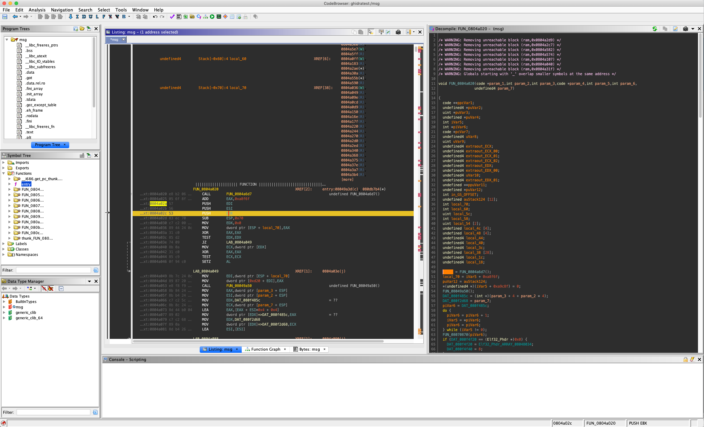

# Ghidra-Config

Silly attempt at creating a ida-consconance or "monokai-ish" theme for Ghidra.

Also contains a few "make ghidra more ida-like" tweaks thanks to [Andoryuu](https://twitter.com/AndoryuuRE/status/1103147503132655616)





## How to install
You have to merge it into ghidras dotfiles yourself:

``` $HOME/.ghidra/.ghidra-9.0/tools ```


## Things to figure out
- [ ] Get the colour of Function Graph right
- [ ] Get the colour of hex editor right
- [ ] Actually check that there is no derps